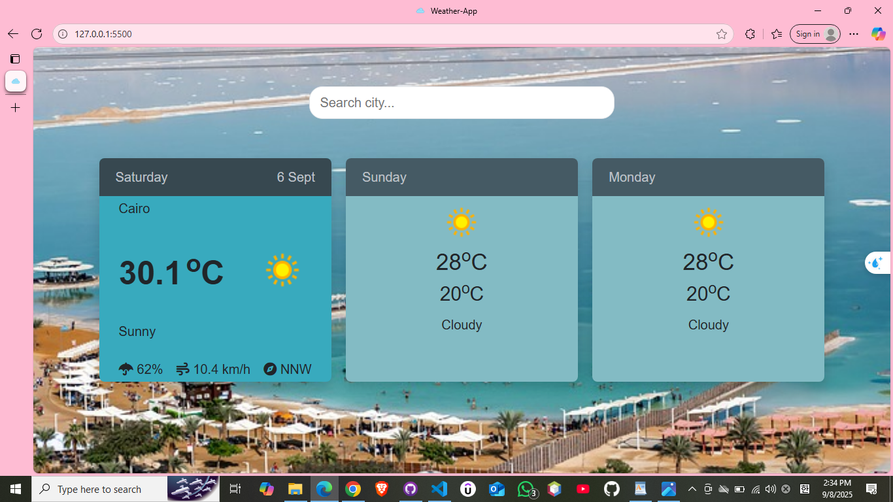

# 🌤️ Weather App

A simple weather forecast web application built with **HTML**, **CSS**, **Bootstrap 5** and **JavaScript**.  
It allows users to search for a city and view the **3-day weather forecast** including temperature and description. 

---

## 🚀 Features
- Search for weather by **city name**.
- Shows **3-day forecast** (date, temperature, wind speed, description, and icons).
- Built with **Bootstrap 5** for responsive design.
- Uses **OpenWeatherMap API**.
- Friendly error messages if the city is not found.

---

## 🛠️ Technologies Used
- **HTML5**
- **CSS3**, (Bootstrap 5)
- **JavaScript (ES6)**
- **OpenWeatherMap API**

---

## 📸 Demo

